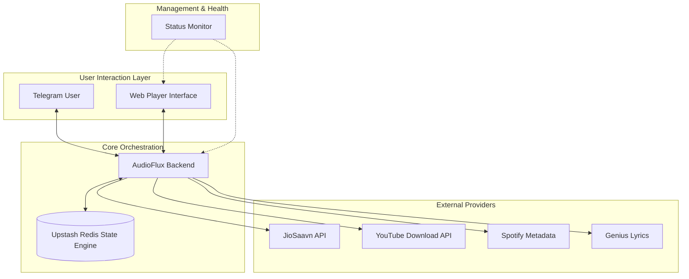

# 🎵 AudioFlux Ecosystem

**A high-performance, real-time music ecosystem seamlessly integrated with Telegram. Stream, sync, and monitor music playback across devices with millisecond precision.**

Developed and Maintained by **[@4nuxd](https://github.com/4nuxd)**.

🌐 **[Website](https://www.audioflux.online/)** • 📚 **[Documentation](https://www.audioflux.online/docs)**

---

## 🏗️ System Architecture & Connectivity

AudioFlux is a distributed system designed for low-latency synchronization and high availability. It bridges the gap between the Telegram Bot API and a high-fidelity web interface.

---

## ✨ Technical Highlights

### ⚡ Real-Time Synchronization
- **Clock Drift Correction**: Uses server-time offsets to ensure all connected clients play the same millisecond of a song simultaneously.
- **Socket.IO State Bursts**: Immediate broadcast of play/pause/skip events to all occupants of a room.

### 🎨 Premium User Experience
- **Adaptive Theming**: The Web Player automatically synchronizes its color palette and transparency with the user's Telegram theme (Light/Dark/Custom).
- **Glassmorphic Design**: A state-of-the-art UI utilizing backdrop blurs, vibrant gradients, and fluid animations via Framer Motion.

### 🔍 Unified Music Intelligence
- **Multi-Source Logic**: Intelligently falls back from JioSaavn to YouTube if a track is missing or restricted.
- **Smart Conversion**: Automatically maps Spotify links to play-ready YouTube streams in real-time.

---

## 📦 Component Breakdown

| Module | Role | Key Technologies |
| :--- | :--- | :--- |
| **[Backend](file:///home/g4rxd/Desktop/Projects/AudioFlux/audioflux-backend/README.md)** | **The Authority**: Manages queues, users, rooms, and state broadcasts. | Node.js, Socket.io, Redis, Telegraf |
| **[Frontend](file:///home/g4rxd/Desktop/Projects/AudioFlux/audioflux-frontend/README.md)** | **The Interface**: High-fidelity playback and real-time visual feedback. | Next.js 16, Tailwind 4, Radix UI |
| **[Status](file:///home/g4rxd/Desktop/Projects/AudioFlux/audioflux-status/README.md)** | **The Guardian**: Proactive health checks and connectivity dashboard. | Next.js Edge, Proactive Monitoring |

---

## 🚀 Deployment Orchestration

To ensure a functional ecosystem, deploy in this specific order:

### 1. The Foundation (Backend)
Deploy the `audioflux-backend` first. It serves as the primary data and socket provider.
- **Must-Have**: Valid `BOT_TOKEN`, `REDIS_URL`, and `OWNER_ID`.
- [Detailed Backend Setup Guide](file:///home/g4rxd/Desktop/Projects/AudioFlux/audioflux-backend/README.md#detailed-setup-guide)

### 2. The Face (Frontend)
Deploy the `audioflux-frontend` once the backend URL is stable.
- **Must-Have**: `NEXT_PUBLIC_API_URL` pointing to your deployed backend.
- [Detailed Frontend Setup Guide](file:///home/g4rxd/Desktop/Projects/AudioFlux/audioflux-frontend/README.md#-detailed-setup-guide)

### 3. The Watchtower (Status)
Deploy the `audioflux-status` last to monitor the live instances.
- **Must-Have**: URLs for both the backend and frontend landing pages.
- [Detailed Status Setup Guide](file:///home/g4rxd/Desktop/Projects/AudioFlux/audioflux-status/README.md#-detailed-setup-guide)

---

## 🤝 Support & Contribution

- **Updates Channel**: [@AudioFlux](https://t.me/audioflux)
- **Developer Support**: [@4nuxd](https://github.com/4nuxd) - Reach out for deployment help or custom provider integration.

© 2026 **4nuxd**. Released under the [MIT License](LICENSE).
