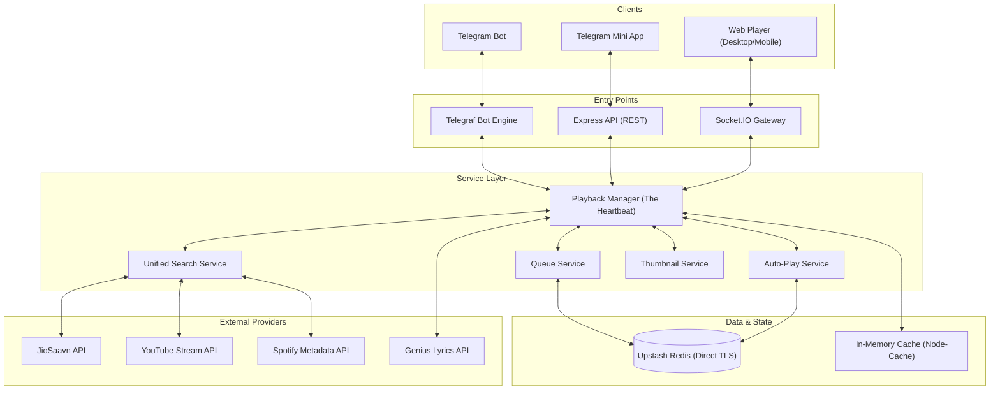

# 🎵 AudioFlux Backend

**The robust, high-performance engine powering the AudioFlux ecosystem. A seamless fusion of Telegram Bot, Mini App, and Real-time Web Synchronization.**

Developed and Maintained by **[@4nuxd](https://github.com/4nuxd)**.

---

## 🚀 Features at a Glance

AudioFlux isn't just a music player; it's a social listening experience designed for speed, stability, and aesthetics.

### 🎧 Core Playback
- **Multi-Source Streaming**: Native support for **JioSaavn** (High Quality), **YouTube**, and **Spotify** (via metadata conversion).
- **Global Sync**: Millisecond-accurate synchronization across all connected clients using Socket.io.
- **Intelligent Auto-Play**: Smart song suggestions engine that keeps the music going based on the current track's vibe.
- **Advanced Queue**: Drag-and-drop management, real-time updates, and session history tracking.
- **Lyrics Engine**: Multi-source lyrics fetching (JioSaavn, Lyrics.ovh, Genius) with automatic HTML cleaning.

### 🤖 Telegram Bot Integration
- **Feature-Rich Interface**: Modular bot commands for group and private music management.
- **Interactive Buttons**: Elegant inline keyboards for playback control, language selection, and help menus.
- **Private Music Rooms**: Users can create private DM rooms with specialized invite links and member management.
- **Anti-Spam & Security**: Built-in rate limiting, global ban system (user/chat), and signature-based WebApp validation.
- **Moderation Tools**: Granular permission system (Owner, Admin, Moderator, Approved User).

### 📊 System & Monitoring
- **Redis State Management**: High-speed, persistent storage for queues, state, and user statistics.
- **Rich Activity Logging**: Real-time logging of bot actions to a dedicated Telegram logger group for owners.
- **Premium Thumbnails**: Dynamic, high-quality player thumbnails generated on-the-fly using `canvas`.
- **Health Dashboard**: Integration with Heroku Platform API for deep monitoring of dynos, memory, and add-ons.

---

## 🏗️ Technical Architecture

AudioFlux uses a modular layer-based architecture designed for low-latency interaction and high availability.



### 📂 Directory Structure
- `bot/`: Modular bot implementation (commands, callbacks, middleware).
- `services/`: Core business logic (playback, queue, search, etc.).
- `controllers/`: API request handlers.
- `routes/`: Express endpoint definitions.
- `utils/`: Helpers, loggers, and API wrappers.
- `socket/`: Real-time communication logic.
- `redis.js`: Centralized Redis data access client.
- `server.js`: Application entry point.

---

## �️ Getting Started

### Prerequisites
- **Node.js**: v20 or higher.
- **Redis**: Upstash (recommended for TLS) or a local instance.
- **Bot Token**: Obtain from [@BotFather](https://t.me/BotFather).
- **Environment Variables**: See [Environment Configuration](#environment-configuration).

### Installation

1. **Clone the repository**:
   ```bash
   git clone https://github.com/4nuxd/audioflux-backend.git
   cd audioflux-backend
   ```

2. **Install dependencies**:
   ```bash
   npm install
   ```

### 🛠️ Detailed Setup Guide

To get AudioFlux running, you need to configure several third-party services. Follow these steps:

#### 1. Telegram Bot Token
- Open Telegram and message [@BotFather](https://t.me/BotFather).
- Use the `/newbot` command to create your bot.
- Copy the **API Token** provided and paste it into `BOT_TOKEN` in your `.env`.

#### 2. Database (Redis)
- Sign up at [Upstash](https://upstash.com/).
- Create a new **Redis** database (Global/Regional).
- In the Upstash dashboard, copy the **Connection URL** (starting with `rediss://`).
- Paste it into `REDIS_URL` in your `.env`.

#### 3. Admin Access
- Find your Telegram User ID using [@userinfobot](https://t.me/userinfobot).
- Paste this number into `OWNER_ID`. This gives you access to commands like `/stats` and `/cmd`.

#### 4. Optional Enhancements
- **YouTube API**: If you have a custom YouTube download provider, set `YOUTUBE_API_URL` and `YOUTUBE_API_KEY`.
- **Spotify**: Create an app in the [Spotify Developer Dashboard](https://developer.spotify.com/dashboard) to get a `CLIENT_ID` and `CLIENT_SECRET` for better search results.
- **Lyrics**: Get a free token from [Genius API](https://genius.com/api-clients) for the `GENIUS_TOKEN` field.

---

## ⚙️ Environment Configuration

> [!IMPORTANT]
> **Manual Configuration Required**: For security reasons, all API tokens, secret keys, and production URLs have been replaced with placeholders. You **must** create a `.env` file based on `.env.example` and provide your own valid credentials for the bot to function correctly.


| Variable | Description | Default |
| :--- | :--- | :--- |
| `BOT_TOKEN` | *Required.* Your Telegram Bot Token. | - |
| `REDIS_URL` | *Required.* Redis connection string (`rediss://...` for TLS). | - |
| `OWNER_ID` | *Required.* Your Telegram User ID for admin access. | - |
| `LOGGER_GROUP_ID` | Telegram Chat ID for real-time activity logs. | - |
| `API_URL` | Base URL for the JioSaavn provider API. | - |
| `BACKEND_URL` | The public URL where this backend is hosted. | - |
| `FRONTEND_URL` | The public URL of the AudioFlux Web Player. | - |
| `SPOTIFY_CLIENT_ID` | Spotify API Client ID for search enrichment. | - |
| `YOUTUBE_API_KEY` | Custom YouTube Provider API Key. | - |
| `YOUTUBE_API_URL` | Full endpoint for the YouTube download API. | - |
| `GENIUS_TOKEN` | Genius Access Token for lyrics fetching. | - |

---

## 🤖 Command Reference

### 🎧 User Commands
- `/play <query>`: Instantly play a song or search for options.
- `/queue`: Display the current music queue for the chat.
- `/player`: Get a deep-link to the synced web player.
- `/np`: Current "Now Playing" status with interactive controls.
- `/skip`: Initiate a skip request (with vote tracking).
- `/lyrics`: Fetch lyrics for the current song.

### 🛡️ Admin & Owner Commands
- `/stats`: Deep analytics of users, rooms, and server health.
- `/banuser <id>`: Ban a user from using the bot globally.
- `/approvechat <id>`: Authorize a group to use the bot (if approval mode is ON).
- `/broadcast <msg>`: Send a message to all users who have started the bot.
- `/cmd <shell_cmd>`: *Owner only.* Remote shell access (use with caution).
- `/getlog`: Retrieve recent server logs directly in Telegram.

---

## 🌐 API Reference

| Endpoint | Method | Description |
| :--- | :--- | :--- |
| `/api/search/unified` | `GET` | Multi-source search (Saavn, YT, Spotify). |
| `/api/queue/get` | `GET` | Fetch specialized queue data for a room. |
| `/api/validateUser` | `POST` | Secure WebApp `initData` authentication. |
| `/api/lyrics/:id` | `GET` | Fetch cleaned lyrics for a specific song ID. |
| `/health` | `GET` | Comprehensive system health and latency report. |

---

## 🤝 Support & Contribution

If you encounter any issues or have feature suggestions:
- **Updates Channel**: [@AudioFlux](https://t.me/audioflux)
- **Developer**: [@4nuxd](https://github.com/4nuxd)

---

> [!WARNING]
> This software is intended for personal and educational use. Unauthorized redistribution or commercial use of music data may violate the Terms of Service of third-party providers.

© 2026 **4nuxd**. Released under the [MIT License](LICENSE).
