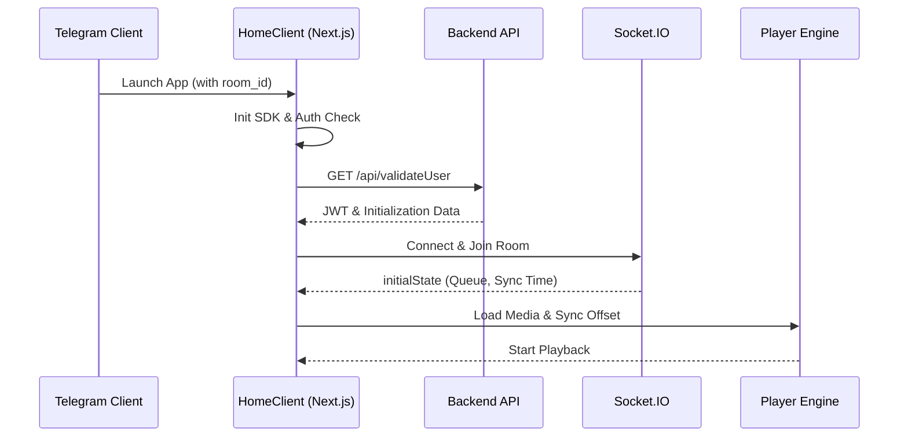

# 🌐 AudioFlux Frontend

**The immersive, high-performance Telegram Mini App client for AudioFlux. A reactive, real-time music player interface built with Next.js and Tailwind CSS.**

Developed and Maintained by **[@4nuxd](https://github.com/4nuxd)**.

---

## ✨ Features & User Experience

AudioFlux Frontend is engineered to provide a premium, native-app feel within the Telegram ecosystem, focusing on fluid animations and perfect synchronization.

### 🎨 Visuals & Feel
- **Adaptive Theming**: Seamlessly integrates with Telegram's light and dark themes using CSS variables and `next-themes`.
- **Micro-Animations**: Purposeful, smooth transitions powered by **Framer Motion** and **Tailwind CSS Animate**.
- **Glassmorphic UI**: A modern "Glass-Panel" aesthetic with high-performance backdrop blurs and mesh gradients.
- **Haptic Feedback**: Tactile interaction for playback controls (Play, Pause, Skip, Like) using the Telegram WebApp SDK.

### 🎧 Seamless Playback
- **Millisecond Sync**: Real-time playback synchronization with the backend via Socket.IO, accounting for network drift.
- **Dual-Player Engine**: Dynamically switches between `<audio>` (for Saavn/MP3) and `<video>` (for YouTube/Spotify streams) to ensure maximum compatibility.
- **Smart Preloading**: Intelligently buffers the next track in the queue for instantaneous transitions.
- **Dynamic Lyrics**: Synchronized, auto-scrolling lyrics display with a unique "art-flip" interaction.

### 📱 Mini App Integration
- **SDK Optimization**: Full utilization of `Telegram.WebApp` methods for back-button navigation, viewport expansion, and user authentication.
- **Wake Lock API**: Prevents the screen from dimming or locking while music is playing.
- **Responsive Layout**: Designed for single-hand mobile use with optimistic UI updates for controls.

---

## 🏗️ Architecture Overview

The frontend acts as a state-synchronized client that communicates with the AudioFlux Backend through a hybrid REST and WebSocket architecture.



### 📂 Directory Structure
- `app/`: Next.js App Router definitions and root layout.
- `components/pages/`: High-level views (`MusicPlayer`, `JoinRoom`, `HomeClient`).
- `components/player/`: Atomic UI components for the music interface (Controls, Search, Lyrics, etc.).
- `components/ui/`: Reusable, accessible components built on **Radix UI**.
- `hooks/`: Custom state and interaction logic (Mobile detection, Toasts).
- `lib/`: Shared utilities and configuration.

---

## 🛠️ Setup & Deployment

### Prerequisites
- **Node.js**: v20 or higher.
- **AudioFlux Backend**: A running instance of the [AudioFlux Backend](https://github.com/4nuxd/audioflux-backend).
- **Environment**: Access to production URLs.

### 🛠️ Detailed Setup Guide

1. **Clone the repository**:
   ```bash
   git clone https://github.com/4nuxd/audioflux-frontend.git
   cd audioflux-frontend
   ```

2. **Install dependencies**:
   ```bash
   npm install
   ```

3. **Configure Environment**:
   Create a `.env.local` file in the root directory. This tells the frontend where to find your backend and how to interact with it.
   ```bash
   # Your backend API URL (e.g., https://api.yourdomain.com)
   NEXT_PUBLIC_API_URL=https://your-backend-api.com
   
   # Usually the same as API_URL (Socket.io fallback)
   NEXT_PUBLIC_WS_URL=https://your-backend-api.com
   
   # The username of your Telegram Bot (without @)
   NEXT_PUBLIC_BOT_USERNAME=YourBotUsername
   ```

4. **Launch Development Server**:
   ```bash
   npm run dev
   ```

3. **Configure Environment**:
   Create a `.env.local` file with your backend URLs.
   ```bash
   NEXT_PUBLIC_API_URL=https://your-api.com
   NEXT_PUBLIC_WS_URL=https://your-api.com
   NEXT_PUBLIC_BOT_USERNAME=AudioFluxBot
   ```

4. **Launch Development Server**:
   ```bash
   npm run dev
   ```

### Deployment
Recommended for **Vercel** or any Node.js hosting platform (Railway, Heroku, Render).
```bash
npm run build
npm start
```

---

## ⚙️ Environment Configuration

> [!IMPORTANT]
> **Manual Configuration Required**: Production URLs and specific environment fallbacks have been replaced with placeholders. You **must** configure your `.env` file or environment variables manually to point to your deployed backend.


| Variable | Description |
| :--- | :--- |
| `NEXT_PUBLIC_API_URL` | The base URL of your AudioFlux Backend API. |
| `NEXT_PUBLIC_WS_URL` | The WebSocket (Socket.IO) URL (usually same as API). |
| `NEXT_PUBLIC_BOT_USERNAME` | The username of the Telegram Bot associated with the project. |

---

## 🤝 Support & Contribution

If you find a bug or want to suggest a feature:
- **Repo Support**: [GitHub Issues](https://github.com/4nuxd/audioflux-frontend/issues)
- **Updates Channel**: [@AudioFlux](https://t.me/audioflux)
- **Developer**: [@4nuxd](https://github.com/4nuxd)

---

> [!CAUTION]
> This frontend is strictly designed for the Telegram Mini App environment. While it can run in a browser, features like user authentication and haptic feedback require the Telegram SDK.

© 2026 **4nuxd**. Licensed under the [MIT License](LICENSE).
