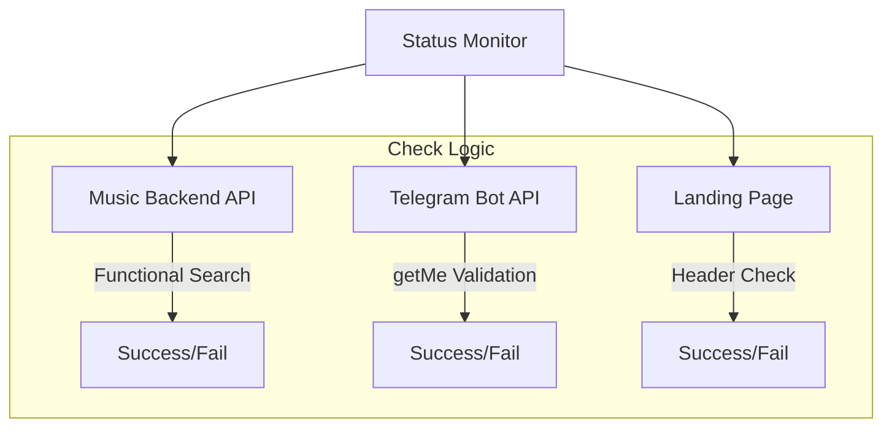

# 📊 AudioFlux Status Monitor

**The premium system health dashboard for AudioFlux. Real-time monitoring for backend APIs, landing pages, and Telegram bot connectivity.**

Developed and Maintained by **[@4nuxd](https://github.com/4nuxd)**.

---

## ✨ Features

- **Proactive Health Checks**: Goes beyond simple pings by performing functional API tests (e.g., executing a sample music search).
- **Glassmorphic Dashboard**: A high-end, responsive UI that looks stunning on both desktop and mobile.
- **Micro-Sync Architecture**: Uses a smart caching layer to provide instant status updates without overloading downstream services.
- **Automated Monitoring**: Built-in support for scheduled checks via Vercel Cron or external triggers.
- **Incident Reporting**: Quick-action links for users to report system issues directly to the support group.

---

## 🏗️ Monitoring Architecture

The status monitor operates as an independent service, ensuring that even if the primary backend is down, the status page remain accessible.



### 🔍 Health Check Strategy
1. **Landing Page**: Performs a `HEAD` request to verify the web server is reachable and responding.
2. **Music API**: Executes a real `GET` request to the search endpoint to ensure the database and music sources are functional.
3. **Telegram Bot**: Calls the standard Telegram `getMe` API to verify the bot token is active and the Telegram connection is stable.

---

## 🛠️ Setup & Deployment

### Prerequisites
- **Node.js**: v20 or higher.
- **pnpm**: Recommended package manager.

### 🛠️ Detailed Setup Guide

1. **Clone the repository**:
   ```bash
   git clone https://github.com/4nuxd/audioflux-status.git
   cd audioflux-status
   ```

2. **Install dependencies**:
   ```bash
   npm install
   ```

3. **Configure Environment**:
   Create a `.env.local` file. This allows the status monitor to track your individual services.
   ```bash
   # The public URL of your Music Backend API
   API_URL=https://your-backend-api.com
   
   # The URL of your landing page or frontend
   LANDING_URL=https://your-landing-page.com
   
   # Your Telegram Bot Token (to check bot status)
   TELEGRAM_BOT_TOKEN=your_bot_token_here
   ```

4. **Launch Development Server**:
   ```bash
   npm run dev
   ```

---

## ⚙️ API Reference

| Endpoint | Method | Description |
| :--- | :--- | :--- |
| `/api/status` | `GET` | Returns current system health from cache. |
| `/api/cron/health-check` | `GET` | Triggers a fresh check and refreshes the cache. |

---

## 🤝 Support & Contribution

- **Repo Support**: [GitHub Issues](https://github.com/4nuxd/audioflux-status/issues)
- **Updates Channel**: [@AudioFlux](https://t.me/audioflux)
- **Developer**: [@4nuxd](https://github.com/4nuxd)

---

> [!NOTE]
> For production environments, it is recommended to set up an external cron job (e.g., Vercel Cron) to call `/api/cron/health-check` every 15 minutes to keep the status dashboard accurate.

© 2026 **4nuxd**. Licensed under the [MIT License](LICENSE).
